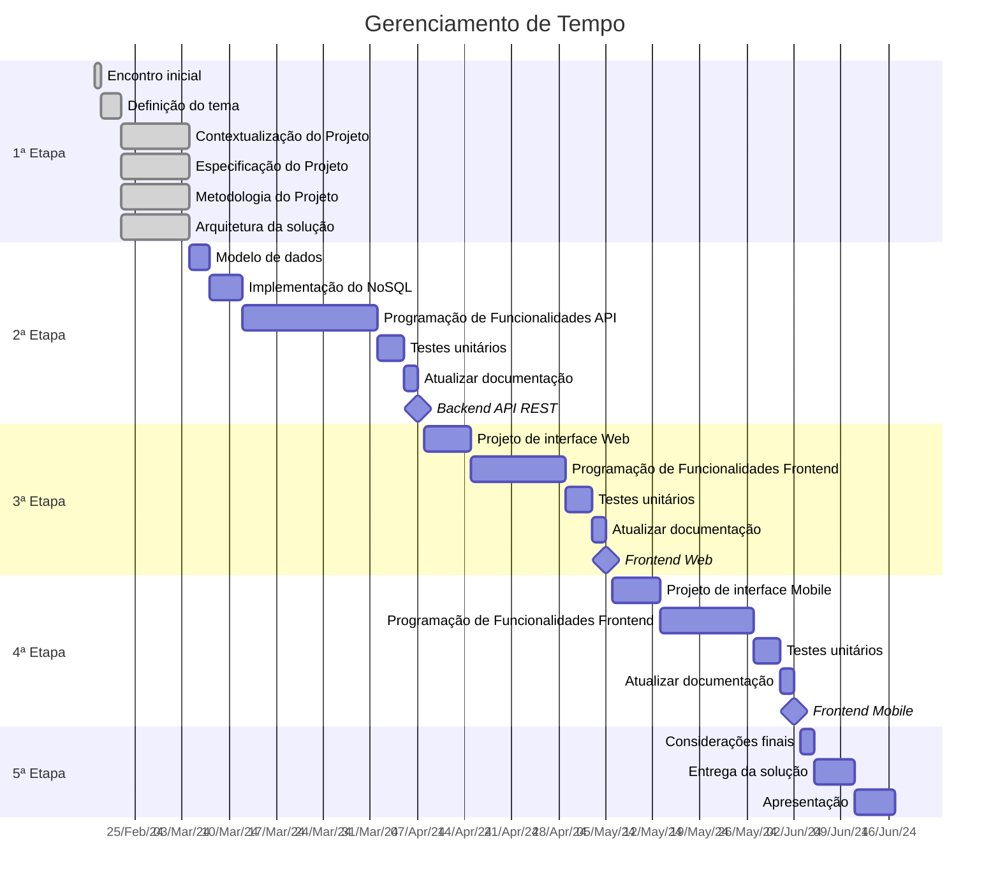

# Especificações do Projeto

Pré-requisitos: <a href="1-Documentação de Contexto.md"> Documentação de Contexto</a>

A definição dos problemas e necessidades detectados para idealizar esse projeto, advém principalmente de trabalhos de imersão feitos pelos integrantes do grupo. Foram feitas pesquisas através de artigos, reportagens, vídeos e conversas com pessoas que se encaixam no perfil do público-alvo;

## Personas

Personas - As personas levantadas durante o processo de entendimento do problema são apresentadas no quadro a seguir.

<h3 align="center"> Persona 1 </h3>

| **Aspectos**        | **Detalhes**                                       | **Observações**                                    |
|---------------------|----------------------------------------------------|----------------------------------------------------|
| **Nome**            | Joana                                              |                                                    |
| **Estado Civil**    | Solteira                                           |                                                    |
| **Idade**           | 22 anos                                            |                                                    |
| **Ocupação**        | Mestrado na área de Arquitetura                    |                                                    |
| **Salário**         | R$ 2.500,00                                        |                                                    |
| **Características** | Sonhadora, Calma, Dedicada, Adora animais de estimação e a natureza| Vegana, Feminista, Minimalista, Engajada em causas sociais |
| **Aplicativos**     | Corte de Tampa, Tela, Instagram                    | Twitter, Pinterest                                 |
| **Hobbies**         | Fazer trilha, Ler                                  | Ouvir música, Cozinhar                             |
| **Frustrações**     | Consumismo exacerbado, Descaso com a natureza      | Capitalismo Desenfreado, "Não consigo fazer mais pelo planeta" |
| **Valores/Crenças** | Preservação ambiental, Consumir o necessário       | Acredita que menos é mais                          |
| **Motivações**      | Ser uma pessoa melhor, Ajudar pessoas e o planeta  | Criar projetos de moradias sustentáveis            |

<h3 align="center"> Persona 2 </h3>

| **Aspectos**        | **Detalhes**                                       | **Observações**                                    |
|---------------------|----------------------------------------------------|----------------------------------------------------|
| **Nome**            | Laura                                              |                                                    |
| **Idade**           | 29 anos                                            |                                                    |
| **Ocupação**        | Médica                                             |                                                    |
| **Salário**         | R$ 12.000,00                                       |                                                    |
| **Estado Civil**    | Noiva                                              |                                                    |
| **Características** | Extrovertida, Determinada, Independente            | Consumista (quer melhorar), Focada na carreira, Não quer ter filhos |
| **Aplicativos**     | Instagram, Twitter, Linkedin                       | Pinterest, Mojo                                    |
| **Hobbies**         | Ler, Sair com as amigas, Conhecer bons restaurantes| Comprar roupas, bolsas e sapatos, Viajar           |
| **Valores/Crenças** | É leal a si mesma e aos seus objetivos             | Quem não vai à luta perde a batalha, Acredita que o sucesso depende do trabalho |
| **Frustrações**     | É muito perfeccionista                             | Não abriu seu próprio consultório, Não fez especialização internacional, Não ser menos consumista|
| **Motivações**      | Ser uma profissional bem sucedida, Tentar ser menos consumista| Ajudar pacientes, Comprar casa e casar  |

<h3 align="center"> Persona 3 </h3>

| **Aspectos**        | **Detalhes**                                       | **Observações**                                    |
|---------------------|----------------------------------------------------|----------------------------------------------------|
| **Nome**            | Clara                                              |                                                    |
| **Idade**           | 32 anos                                            |                                                    |
| **Ocupação**        | Empresária (consultoria de imagem)                 |                                                    |
| **Salário**         | Entre R$ 20.000,00 e R$ 30.000,00                  |                                                    |
| **Estado Civil**    | Casada com um filho                                |                                                    |
| **Características** | Trabalha muito, Determinada, Apaixonada pela família| Dedicada, Detalhista                              |
| **Aplicativos**     | Revistas de moda, Instagram                        | Pinterest                                          |
| **Hobbies**         | Viajar, Correr, Cozinhar, Ler                      | Sair para teatros e museus, Ficar com a família    |
| **Valores/Crenças** | Vestir-se para o cargo desejado                    | Trabalhar é servir, Esforço pela família           |
|                     | A família é a base do sucesso                      | A aparência importa                                |
| **Frustrações**     | Não pode aumentar a família                        | Morar longe dos pais, Dificuldades de empreender   |
| **Motivações**      | Ter uma família feliz e unida,  Ser bem sucedida   | Ajudar mulheres a se sentirem mais bonitas e poderosas e Comprar uma casa no campo|

## Histórias de Usuários

A partir da compreensão do dia a dia das personas identificadas para o projeto, foram registradas as seguintes histórias de usuários.

| EU COMO (Persona) | QUERO/PRECISO (Funcionalidade) | PARA (Motivo/Valor) |
|-------------------|--------------------------------|---------------------|
| Joana             | Fazer uso das funcionalidades do app para catalogar todas as minhas peças de roupas, sapatos e acessórios | Criar mais combinações de looks, mesmo com poucas peças |
| Joana             | Fazer uso das funcionalidades do app para ter um estilo próprio e autêntico, mas sem cair na armadilha do consumo desenfreado | De forma criativa e consciente, fugir das amarras do consumismo. Promover um mundo mais equilibrado no âmbito ambiental e pessoal |
| Joana             | Fazer uso das funcionalidades do app para diminuir meu consumo de roupas desnecessárias | Promover um estilo de vida mais minimalista e sustentável |
| Laura             | Fazer uso das funcionalidades do app para adotar uma mentalidade minimalista em relação à moda com foco nas roupas que realmente precisam, coibindo compras impulsivas | Reduzir o consumo de peças de roupas novas e investir em peças de qualidade, com maior durabilidade e especificidades |
| Laura             | Fazer uso das funcionalidades do app para catalogar peças velhas, gastas | Reparar itens danificados e doar a terceiros |
| Laura             | Fazer uso das funcionalidades do app para rastrear peças e acessórios em desuso | Trocar e assim adquirir peças multifuncionais e ecológicas |
| Clara             | Fazer uso das funcionalidades do app com mais praticidade, agilidade e foco na vestimenta da ocasião | Assessoria visual na montagem de looks diários |
| Clara             | Fazer uso das funcionalidades do app priorizando o consumo e novas aquisições de peças mais resistentes | Evitar o consumo de produtos sintéticos e de difícil resistência |
| Clara             | Fazer uso das funcionalidades do app e organizar meu armário por segmento de uso (descolado, empresarial, moda praia, inverno, etc) | Evitar compras de itens que já possuo, bem como itens que não combinam com o que já tenho |

## Modelagem do Processo de Negócio 

### Análise da Situação Atual

#### Problemas Existentes:

- Gestão ineficiente de roupas: roupas em excesso por pessoa que não sabem como organizá-las.
- Desperdício: roupas não usadas e descartadas contribuem para o desperdício.

#### Modelo Atual:

Atualmente, as pessoas utilizam métodos tradicionais, como armários físicos e gavetas, para gerenciar suas roupas. Algumas usam planilhas ou aplicativos básicos de lista, mas essas soluções não oferecem funcionalidades como troca, venda ou doação de itens.

### Descrição Geral da Proposta

#### Limites:

O aplicativo tem como foco itens de vestúario.

#### Estratégias e Objetivos:

- Oferecer uma plataforma intuitiva para gerenciar itens de vestuário.

#### Oportunidades de Melhorias:

- Automatizar o processo de categorização.

## Indicadores de Desempenho

**Indicador**|**Objetivo**|**Descrição**|**Fonte e Dados**|**Perspectiva**
:-----:|:-----:|:-----:|:-----:|:-----:
Taxa de Utilização do Closet Online|Estimular a inserção de peças no closet online|Percentual de peças de roupas cadastradas|Banco de Dados de Peças|Interna
Taxa de Uso da Funcionalidade de Montagem de Looks|Avaliar a utilidade da funcionalidade|Percentual de usuários que utilizaram a funcionalidade|Registro de Atividades|Cliente
Taxa de Sucesso em Adicionar/Excluir Peças|Verificar a eficiência das ações|Percentual de ações de adição/exclusão de peças bem-sucedidas|Registro de Atividades|Interna
Taxa de Sucesso de Login|Monitorar a eficiência de login|Percentual de logins bem-sucedidos|Registro de Atividades|Interna

## Requisitos

A fase inicial do desenvolvimento de um software passa pela definição e elaboração de seus requisitos funcionais, que apresentam as possibilidades de interação entre o usuário e o programa, bem como a definição de seus requisitos não funcionais que são aqueles que norteiam os aspectos que o sistema deve apresentar de qualidade e construção. Ambos serão apresentados a seguir. 

### Requisitos Funcionais

A Tabela a seguir apresenta os requisitos funcionais do projeto, bem como suas prioridades de desenvolvimento e entrega.

|ID    | Descrição do Requisito                                                                                     |Prioridade|
|------|------------------------------------------------------------------------------------------------------------|----------|
|RF-001| Permitir que o usário crie um cadastro de acesso. (registro)                                               |   ALTA   |
|RF-002| Os usuários devem conseguir realizar o cadastro de nova conta.                                             |   BAIXA  |
|RF-003| Permitir que o usário acesse a conta através de login e senha                                              |   ALTA   | 
|RF-004| Permitir que o usuário cadastre (adicione) novas peças de roupas.                                          |   ALTA   | 
|RF-005| Os usuários devem poder criar novos looks e salvalos.                                                      |   ALTA   |
|RF-006| Os usuários podem visualizar os items cadastrados em uma galeria.                                          |   ALTA   |
|RF-007| Permitir que aos usuários removam os items cadastradas.                                                    |   ALTA   |
|RF-008| Os usuários devem poder criar looks combinando diferentes peças de roupa do seu guarda-roupa.              |   MÉDIA  | 
|RF-009| Os usuários podem filtrar suas roupas por categorias (por exemplo, camisetas, calças, vestidos, etc.)      |   ALTA   |

### Requisitos não Funcionais

A tabela a seguir apresenta então os requisitos não funcionais do projeto, apresentando também as prioridades quanto ao desenvolvimento e entrega.

|ID     | Descrição do Requisito                                                                                                                                               |Prioridade |
|-------|----------------------------------------------------------------------------------------------------------------------------------------------------------------------|-----------|
|RNF-001| O sistema deve ser desenvolvida em uma Aplicação Distribuída.                                                                                                           | MÉDIA| 
|RNF-002| O aplicativo deve responder de forma rápida e suave aos comandos do usuário, minimizando atrasos e travamentos.                                                      |   MEDIA  | 
|RNF-003| A interface do usuário deve ser intuitiva e de fácil compreensão, permitindo que os usuários interajam com o aplicativo sem dificuldades.                            |   ALTA    |
|RNF-004| Dados pessoais dos usuários, como informações de login e detalhes do guarda-roupa, devem ser protegidos por meio de criptografia e práticas seguras de armazenamento.|   ALTA    |
|RNF-005| O código-fonte do aplicativo deve ser organizado de forma modular e reutilizável para facilitar a manutenção e futuras atualizações.                                 |   MEDIA   |

## Restrições

O projeto está restrito pelos itens apresentados na tabela a seguir.

|ID   | Restrição                                                                 |
|-----|---------------------------------------------------------------------------|
|RE-01| O projeto deverá ser entregue até a data limite.                          |
|RE-02| O aplicativo se restringe ao desenvolvimento de uma Aplicação Distribuída.|
|RE-03| A equipe do projeto não poderá subcontratar o desenvolvimento do projeto. |

## Diagrama de Casos de Uso

# Matriz de Rastreabilidade

A matriz de rastreabilidade é uma ferramenta usada para facilitar a visualização dos relacionamento entre requisitos e outros artefatos ou objetos, permitindo a rastreabilidade entre os requisitos e os objetivos de negócio. 

A matriz abaixo contempla todos os elementos relevantes e suas conexões que fazem parte do aplicativo My Closet:

# Gerenciamento de Projeto

De acordo com o PMBoK v6 as dez áreas que constituem os pilares para gerenciar projetos, e que caracterizam a multidisciplinaridade envolvida, são: Integração, Escopo, Cronograma (Tempo), Custos, Qualidade, Recursos, Comunicações, Riscos, Aquisições, Partes Interessadas. Para desenvolver projetos um profissional deve se preocupar em gerenciar todas essas dez áreas. Elas se complementam e se relacionam, de tal forma que não se deve apenas examinar uma área de forma estanque. É preciso considerar, por exemplo, que as áreas de Escopo, Cronograma e Custos estão muito relacionadas. Assim, se eu amplio o escopo de um projeto eu posso afetar seu cronograma e seus custos.

## Gerenciamento de Tempo

O gerenciamento de tempo em projetos de TI é essencial para manter o projeto no caminho certo, assegurar a utilização eficaz de recursos e evitar surpresas desagradáveis ao longo do processo.

## Gerenciamento de Equipe

A equipe foi organizada, conforme abaixo, da seguinte maneira:

- **Scrum Master:** Andressa Guedes

- **Product Owner:** Andressa Guedes

  **Equipe de Desenvolvimento:**
  * Andressa Guedes
  * Giovanna Maria Elias Coura
  * Sanderlei Cabral
  * Matheus Da Silva Câmara
  * Maria Júlia Silva Medeiros
  * João Pedro Pereira Dos Santos

## Gestão de Orçamento

O processo de determinar o orçamento do projeto é uma tarefa que depende, além dos produtos (saídas) dos processos anteriores do gerenciamento de custos, também de produtos oferecidos por outros processos de gerenciamento, como o escopo e o tempo.

